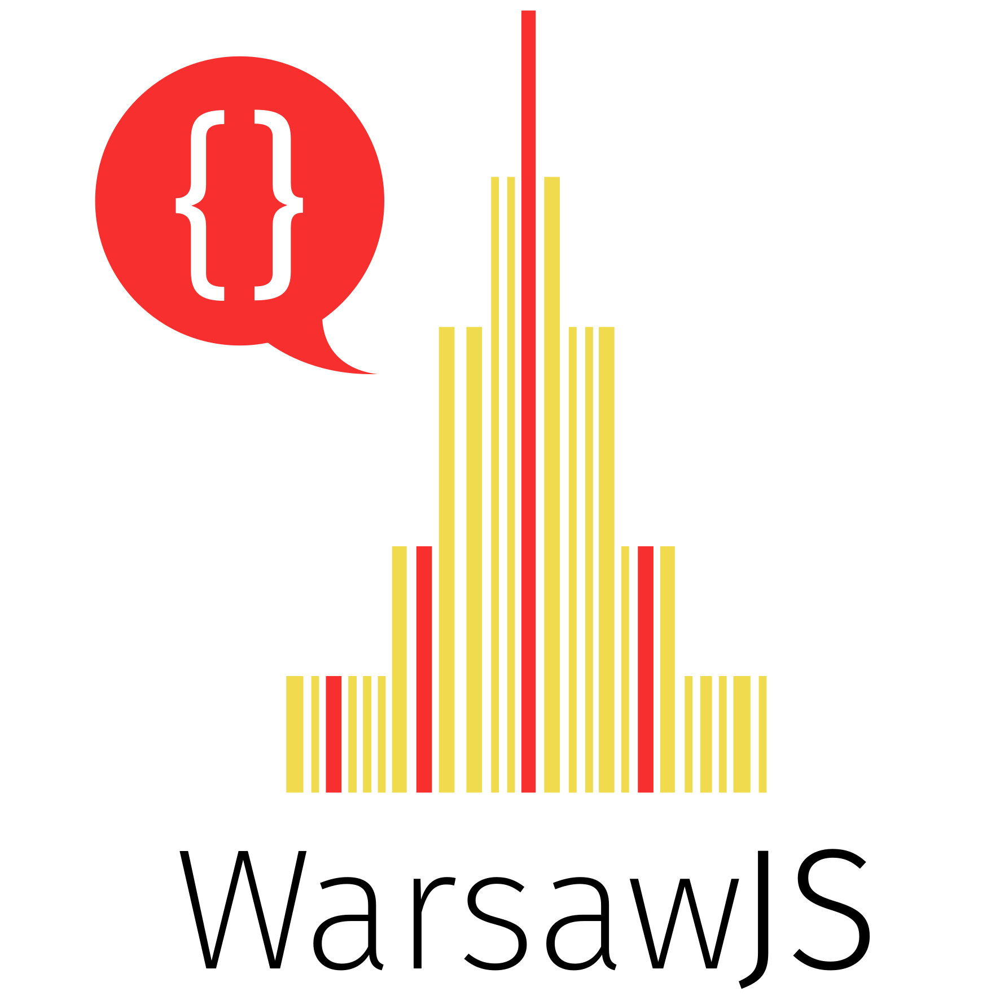

class: slide-front-page

.logo[

]
.details[

## Piotr Kowalski
## <em>"Duck typing w życiu programisty" [PL]</em>
## <small>2018-09-12</small>
## <a href="https://www.linkedin.com/in/piecioshka">linkedin.com/in/piecioshka</a>
]

---

### Pytania?

.size40[

* Czym jest `Duck typing`?
* Jak często go używacie na co dzień?
* Kiedy jest ono niezbędne?
* Czy ta technika występuje tylko w JavaScript?
* Czy to źle, że korzystam z `Duck typingu`?
* ...oraz <samp>Wasze</samp>!

]

---

class: middle, slide-fullscreen-blockquote

> "Jeśli chodzi jak kaczka i kwacze jak kaczka, to musi być kaczką."
> <small>Wikipedia - https://pl.wikipedia.org/wiki/Duck_typing</small>

---

class: middle, center

# Ocenianie.

## _Angular_ -owa szufladka

---

### Wróćmy do kodu...

# Rozpoznanie obiektu po jego <var>zawartości</var>, a <samp>nie</samp> na podstawie deklaracji.

---

### Back-end, np. <var>strona z filmami</var>

.size40[

```json
{
    title: "Rocky",
    poster: "..."
}
```

]

.size40[

```json
{
    title: "Przyjaciółki odc. 147",
    thumbnail: "..."
}
```

]

---

class: middle, slide-invert-colors

# Demo 🎉 #1

## `src/strategies/`

---

class: middle

# TypeScript i jego <mark>rzutowanie typów</mark>

---

class: middle, slide-invert-colors

# Demo 🎉 #2

<https://github.com/piecioshka/typescript-playground>

---

### No okey...

* Jak pobrać deklarację obiektu?
    + z modelu
* A jak pobrać jeśli dane dostajemy z serwera?
    + z modelu
* Konwersja danych na model!

---

## Model (akceptujący wszystko)

.size30[

```js
class Movie {
 constructor(options) {
  Object.keys(options).forEach((key)=>{
    this[key] = options.key;
  })
 }
}

m = new Movie({ title: 'Terminator' });
m.constructor.name // Movie (WARNING: minification)
Object.getPrototypeOf(m).constructor === Movie // true
m instanceof Movie // true
```

]

---

### Array-like

* `arguments`
* object z numerowanymi kluczami

_Wszystko może być `array-like` poza `null`, `undefined`_

* Jak sprawdzić, czy `array-like` jest tablicą?
    + Sprawdzić, czy `length` jest numeryczne.
* Konwersja za pomocą
    + ES5: `Object.prototype.slice.call(x)`
    + ES6: `[...arr]` , `Array.from(arr)`

---

### Array-like: Przykład

_Nie indeksuje się po właściwości tablicy, tylko po jej elementach!_

Dlatego:

.size30[

```js
a = [];
a.foo = 'bar';
a.length === 0; // true
a.forEach(() => {
    // nothing here
})
```

]

---

class: middle

### <samp>Ciekawostka</samp>: Promise

.size50[

`Object` z funkcją `then` 😅

]

---

### <samp>Ciekawostka</samp>: Promise - przykład 1

.size30[

```js
const promiseLike = {
    then(cb) {
        cb('hue hue');
    }
}

promiseLike
    .then((...args) => {
        console.log(...args); // "hue hue"
    })
```

]

---

### <samp>Ciekawostka</samp>: Promise - przykład 2

.size30[

```js
const promiseLike = {
    then(cb) {
        cb('hue hue');
    }
}

async function setup() {
    const v = await promiseLike;
    console.log(v);  // "hue hue"
}

setup();
```

]

---

class: middle, center

### Polecam!

<samp>Mariusz Nowak</samp> <mark>"Kind of JavaScript"</mark> [WarsawJS Meetup #26](https://www.facebook.com/events/1771669339763323/)

<iframe width="560" height="315" src="https://www.youtube.com/embed/fQIvfgrjGSE?t=12m57s" frameborder="0" allow="autoplay; encrypted-media" allowfullscreen></iframe>

---

class: middle, center, slide-invert-colors, no-display-my-logo

# <samp>Dziękuję!</samp>


.size30[
» [fb.com/piecioshka.dev](https://fb.com/piecioshka.dev) «
]
